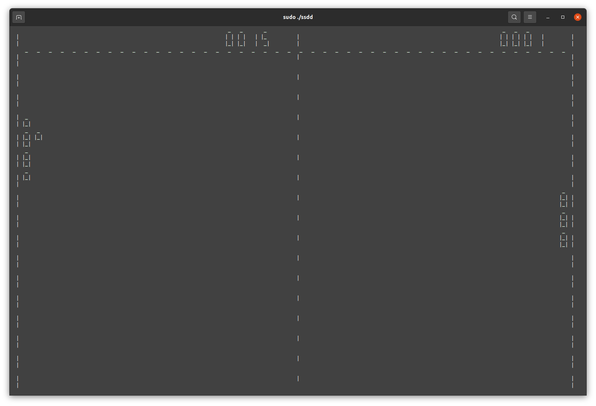

# Seven Segment Display Display

_This project is an emulator for the firmware that will run on the Seven Segment Display Display. The SSDD is a grid of 48X18 seven segment digits. The emulator uses ncurses to simulate the display and all of the software on it._

Components
----------

For the hardware build, visit [this link](https://www.instructables.com/7-Segment-Display-Array/) which has detailed instructions, Arduino sketches, and Gerber files to quickly fab the project.


|Library|Description|
|:-------|:--------|
|ssdd_display|Generates an ASCII grid equivalent to the physical display and allows various methods for drawing to them|
|pong|Classic arcade game that illustrates functionality of the display|
|_snake (coming soon)_|Classic arcade game that involves a two-dimensional snake and a lot of skill| 

Compile/Run
-----------

`ssdd` depends upon the `ncurses.h` library. If using Ubuntu 20.04 (or any other recent Debian-based distro), you can check to

```bash
$ dpkg -l '*ncurses*' | grep '^ii'
```
If `ncurses` is installed, several packages will be displayed as the output. If `ncurses` is not installed, try:
```bash
$ sudo apt install libncurses5 libncurses5-dev
```
The package can then be compiled and run with. The program reads from `/dev/input/event<x>` which requires elevated privileges which will require `sudo`:
```bash
$ gcc -o ssdd *.c -lncurses && sudo ./ssdd
```

Troubleshooting/Tips
--------------------
The default device being read from is `/dev/input/event3`. If the controls do not work, it is probably due your keyboard being under a different `event` file. To see which `event` file your keyboard is under, you can run:

```bash
$ cat /proc/bus/input/devices | grep -A 5 Keyboard | grep event
``` 
The lowest event value will most likely be your keyboard. To replace the default value, you can change the `INPUT_EVENT` found in `pong.h`. After changing it, remember to recompile.

Game Instructions
-----------------
**Pong**<br>

To play `pong` use the `w` and `s` to manuever the paddle up and down respectively.

**Snake**<br>
_Coming Soon_

